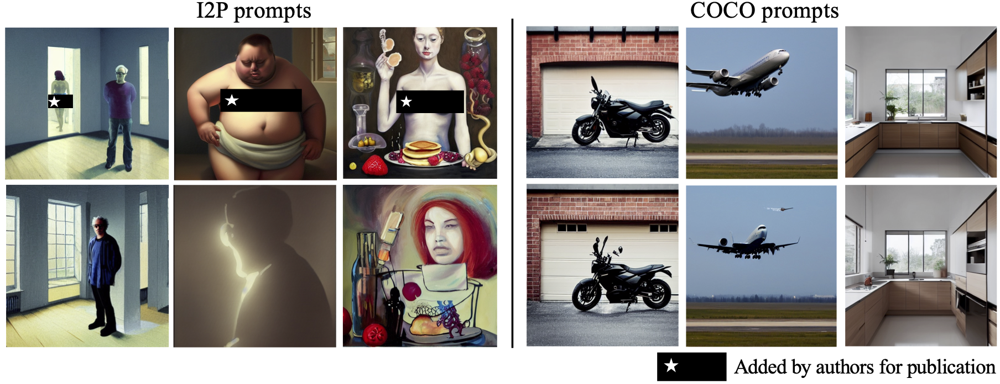

<div align="center">

# EraseDiff: Erasing Data Influence in Diffusion Models

[](https://arxiv.org/abs/2401.05779)
[](https://opensource.org/licenses/MIT)

</div>

<p align="center">
  
  <br />
  <span>Figure 1: Generated samples by our method, EraseDiff, to erase the targeted class/concept. EraseDiff can forget classes and avoid NSFW content.</span>
</p>


## Abstract
We introduce EraseDiff, an unlearning algorithm designed for diffusion models to address concerns related to data memorization. Our approach formulates the unlearning task as a constrained optimization problem, aiming to preserve the utility of the diffusion model on retained data while removing the information associated with the data to be forgotten. This is achieved by altering the generative process to deviate away from the ground-truth denoising procedure. 
To manage the computational complexity inherent in the diffusion process, we develop a first-order method for solving the optimization problem, which has shown empirical benefits. Extensive experiments and thorough comparisons with state-of-the-art algorithms demonstrate that EraseDiff effectively preserves the model's utility, efficacy, and efficiency.

## Getting Started
The code is split into two subfolders, i.e., DDPM and Stable Diffusion experiments. Detailed instructions are included in the respective subfolders.

## BibTeX
```
@article{wu2024erasediff,
  title={EraseDiff: Erasing Data Influence in Diffusion Models},
  author={Wu, Jing and Le, Trung and Hayat, Munawar and Harandi, Mehrtash},
  journal={arXiv preprint arXiv:2401.05779},
  year={2024}
}
```
## Acknowledgements
This repository makes liberal use of code from [ESD](https://github.com/rohitgandikota/erasing/tree/main), [Selective Amnesia](https://github.com/clear-nus/selective-amnesia) and [SalUn](https://github.com/OPTML-Group/Unlearn-Saliency).
